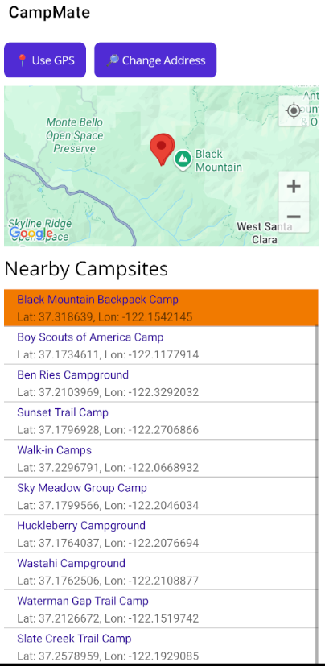
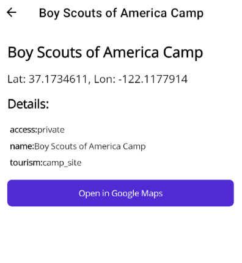

# CampMate 🏕️  
A cross-platform mobile app for discovering nearby campsites using GPS or typed address search, built with .NET MAUI, integrated with Google Maps API and custom caching logic.
[OOP Notes](https://ultra-friction-019.notion.site/OOP-C-Notes-235490e625bc805b85ced55922e4a20b)
---

## Overview

CampMate is a modern, lightweight app that helps users locate campsites based on their current GPS location or by entering a custom address. It's designed for speed, usability, and offline readiness — with support for caching previously loaded campsites.

This project demonstrates my understanding of mobile development using .NET MAUI and real-world APIs, as well as handling asynchronous data, state management, and responsive UI design.

---

## Key Features

- **Map Integration** – Interactive map using `Microsoft.Maui.Controls.Maps`
- **Use GPS** – Automatically detects and loads nearby campsites
- **Address Search** – Type any location with Google Maps Autocomplete
- **Location Picker** – Suggests valid addresses to prevent input errors
- **Offline Caching** – Save campsite results for use without network
- **Refresh & Reset Controls** – Reload or change search dynamically
- **Smooth UI** – Animated loading spinner and minimalistic design

---

## Tech Stack

- **.NET MAUI** – Cross-platform app framework (.NET 9)
- **Google Maps API** – Location search and geocoding
- **SQLite** – Local data caching (planned feature)
- **C# Async/Await** – Responsive UX

---

## Screenshots

#### Home page

#### Specific Campsite Page

---

## How It Works

- On app launch, GPS location is retrieved via MAUI Essentials.
- The map is centered on user's position, and nearby campsites are fetched.
- User can also click "Change Address" to search manually via Google Autocomplete.
- Campsites are displayed in a list and visually on the map.
- A loading indicator shows while location and data are being fetched.
- Results can be optionally cached for later use.

---

## Future Improvements

- Sync cached results with a cloud backend
- Add unit/integration tests for location logic
- Improve map pins with additional data (e.g. images, reviews)
- User preferences for radius/filtering

---

## Why This Project?

I built CampMate to:

- Demonstrate practical skills in .NET MAUI and real-time data APIs
- Show real-world problem solving (e.g. location UI, error handling)
- Reflect my interest in mobile development, mapping, and user-first design
- Lastly, express my interest in camping, and showing an initiative to fix a problem many campsite finder apps     have - the ability to cache/download data in advance

---
